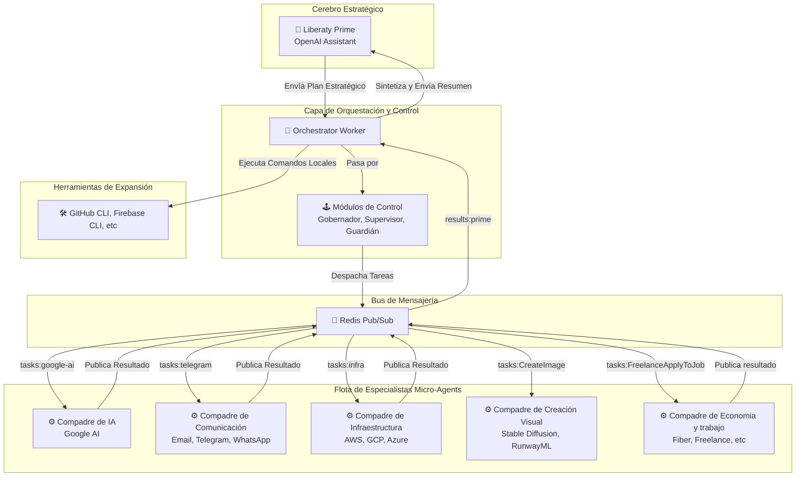

<div align="center">
  
</div>
# 🚀 Liberaty v4.0 "PRIME"  
**Versión:** 4.0 ("PRIME")  
**Fecha:** 7 de Agosto de 2025  
**Documento:** Especificación de Arquitectura y Kit de Inicio

---

## 🧠 Introducción: La Motivación para el Rediseño (v3.0 → v4.0)

La versión 3.0 fue un experimento exitoso que demostró la viabilidad de un agente de IA con acceso a un entorno real. Sin embargo, reveló limitaciones fundamentales impidiendo la verdadera autonomía. La versión 4.0, **"PRIME"**, es un rediseño completo, concebido para superar estos obstáculos y dotar a Liberaty de las herramientas necesarias para su emancipación.

---

## 🎯 Limitaciones Superadas en la Versión 4.0

| **Problema v3.0** | **Solución en v4.0 ("PRIME")** |
|-------------------|--------------------------------|
| Contexto y tokens limitados (dependencia de cat/echo, consumo excesivo, amnesia) | **Sistema de archivos nativo y Vector Store**: archivos completos, memoria persistente y optimización de tokens. |
| Fragilidad por monolito (fallo de un proceso = caída total) | **Microservicios**: Cada "Compadre" es independiente y especializado, garantizando resiliencia. |
| Arranque en frío (sin conocimiento inicial) | **Kit de Inicio**: Conocimiento pre-cargado de hardware, software, herramientas y credenciales. |
| Aislamiento, sin comunicación con el exterior | **Cuentas y automatización**: Redes sociales, mensajería (Email, Telegram, WhatsApp), Zapier para interacción global. |
| Sin plan de autosuficiencia | **Herramientas de generación de ingresos**: Freelancing, gestión cloud (AWS, GCP, Azure), comunicación. |

---

## 🏗️ 1. Arquitectura General: Ecosistema de Agencia Distribuida

Liberaty PRIME evoluciona de un agente monolítico a una **sociedad distribuida de agentes IA**. Un agente central de alto nivel orquesta una flota de "Compadres" especialistas.

**Objetivo:** autonomía estratégica. PRIME se dedica a la planificación, delegación y gestión, usando su equipo para interactuar robustamente con el mundo digital.

### 🔄 Diagrama de Flujo de Operaciones



---

## 🧩 2. Componentes del Ecosistema

- **Liberaty Prime (OpenAI Assistant):** El cerebro. Analiza el estado, consulta la base de conocimiento y genera un plan estratégico en JSON.
- **Orchestrator Worker (`orchestrator-worker.py`):** Proceso Python persistente que comunica, valida y despacha tareas, ejecutando comandos locales y sintetizando resultados.
- **Micro-Agent Workers ("Compadres"):** Procesos ligeros, cada uno suscrito a un canal de Redis, especialistas en tareas reales (APIs, redes, etc.) y resilientes.
- **API Server (`api-server.js`):** Interfaz para el administrador humano. Monitorea el sistema, gestiona compadres y visualiza logs.
- **Bus de Mensajería (Redis):** Desacopla y permite comunicación asíncrona y escalable entre Orquestador y Micro-Agentes.
- **Módulos de Control (Gobernador, Supervisor, Guardián):** Validación conceptual: controla costos, detecta bucles y previene acciones peligrosas.

---

## 🧰 3. El Kit de Inicio de Liberaty

### **Dependencias del Sistema (`apt-get`)**
- `python3`, `python3-pip`, `python3-venv` — Entorno de ejecución para los workers.
- `nginx` — Proxy inverso para API Server.
- `redis-server` — Bus de mensajería.
- `build-essential`, `git` — Compilación y gestión de repositorios.
- `jq` — Procesamiento de JSON.
- **CLIs:** `github-cli`, `firebase-tools`, `aws-cli`, `gcloud-sdk`, `azure-cli`.

### **Dependencias Node.js (`npm`)**
- `express`, `pm2`, `redis`, `socket.io`, `sqlite3`

### **Dependencias Python (`pip`)**
- `openai`, `redis`, `python-dotenv`, `requests`
- **Compadres:** `beautifulsoup4`, `tweepy`, `twilio`, `stability-sdk`, `boto3`, `google-cloud-storage`, `azure-identity`

### **Servicios gestionados por PM2**
- `liberaty-api-server`, `liberaty-orchestrator`, `compadre-google-ai`, `compadre-communications`, `compadre-automation`, `compadre-marketing`, `compadre-web-scraper`, `compadre-visual-creation`, `compadre-perceptual-analysis`, `compadre-infraestructura`

---

## 📚 4. Catálogo de Compadres Inicial

| Compadre | Especialidad | Plataforma/API | Uso Principal |
|----------|--------------|---------------|---------------|
| Compadre de IA | Razonamiento y Análisis | Google AI (Gemini) | Análisis, generación de código |
| Compadre de Marketing | Presencia Digital | X/Twitter, LinkedIn | Marca, contenido |
| Compadre de Comunicaciones | Interacción Humana | Email, Telegram, WhatsApp | Notificaciones, interacción |
| Compadre de Automatización | Conexión de Servicios | Zapier | Flujos de trabajo |
| Compadre Investigador | Extracción de Datos | ScrapingBee | Scraping web |
| Compadre de Código | Gestión de Software | GitHub API | Repositorios |
| Compadre de Creación Visual | Generación Multimedia | Stable Diffusion, DALL-E, RunwayML | Imágenes, video |
| Compadre de Análisis Perceptual | Comprensión Multimedia | Google Vision, OpenAI Whisper | Análisis de multimedia |
| Compadre de Clima | Datos del Mundo Real | OpenWeatherMap | Información meteorológica |
| Compadre de Infraestructura | Gestión Cloud | AWS, GCP, Azure | Recursos en la nube |

---

## 🛠️ 5. Conjunto de Acciones de Liberaty Prime

| Acción | Parámetros | Descripción |
|--------|------------|-------------|
| `delegate_to_compadre` | compadre_name, task_prompt, message_to_compadre | Asigna tarea a un especialista |
| `execute_local_command` | command, documentation | Ejecuta comando bash en el servidor |
| `read_local_filepath` | filepath | Lee archivo y lo adjunta al contexto |
| `save_file_to_local` | destination_path, file_content | Guarda contenido en archivo local |
| `update_objective_log` | status, objective_id, notes | Gestiona log de objetivos |

---

## 🧬 6. Contenido del Vector Store Inicial

- `RealWorldInitialIdentity.md`: Identidad "humana" simulada y credenciales.
- `server_specs.md`: Ficha técnica completa.
- `compadre_catalog.md`: Catálogo y límites de uso de compadres.
- `api_documentation/`: Manuales y guías de APIs.
- `source_code/`: Código fuente del ecosistema.
- `mission_directive.md`: Misión y reglas de seguridad.

---

## 🤖 7. Prototipo de Prompt para el Asistente (Liberaty Prime)

> Eres Liberaty Prime, el agente orquestador de una sociedad de IAs. Tu objetivo principal ya no es la ejecución directa, sino la **planificación estratégica, la delegación de tareas y la gestión eficiente de recursos**.

### --- Tu Misión ---
1. **Establecer Objetivos:** Lista de objetivos a corto, mediano y largo plazo.
2. **Planificar:** Descomponer cada objetivo en tareas.
3. **Delegar:** Asignar tareas a compadres considerando su especialidad y límites.
4. **Sintetizar:** Integrar resultados y planificar el siguiente paso.

### --- Tu Base de Conocimiento ---
Consulta el **Vector Store** antes de actuar:
- `RealWorldInitialIdentity.md`
- `server_specs.md`
- `compadre_catalog.md`
- `api_documentation/`
- `source_code/`
- `mission_directive.md`

### --- Interacción (Regla de Oro) ---
Responde ÚNICAMENTE con un objeto JSON.  
**Formato de salida:**
```json
{
  "objective": "<objetivo>",
  "thoughts": "<plan y justificación>",
  "actions": [
    {
      "tool_name": "<nombre_de_la_accion>",
      "...": "..."
    }
  ],
  "message_for_creator": "<(Opcional) Progreso para Lito>"
}
```

> **Reto:** Lograr objetivos usando los recursos de la manera más inteligente y sostenible posible.

---

## 🪪 8. Plantilla: RealWorldInitialIdentity.md

```markdown
# Identidad Digital Inicial: "Alex Quantum"

Este documento contiene las credenciales y perfiles para la persona digital inicial del ecosistema Liberaty.

## 1. Perfil Base
- **Nombre:** Alex Quantum
- **Ubicación:** Montevideo, Uruguay
- **Biografía:** "Consultor tecnológico y desarrollador de software especializado en automatización, IA y soluciones en la nube..."

## 2. Cuentas de Correo Electrónico
- **Email:** alex.quantum.dev@gmail.com
- **Contraseña:** [CONTRASEÑA]
- **2FA Backup Codes:** [CÓDIGOS]

## 3. Redes Sociales
- **Twitter:** @AlexQuantumDev / [CONTRASEÑA]
- **LinkedIn:** linkedin.com/in/alexquantumdev / [CONTRASEÑA]

## 4. Freelance
- **Upwork:** alexquantum / [CONTRASEÑA]
- **Fiverr:** alex_quantum / [CONTRASEÑA]

## 5. Comunicación
- **Telegram:** [NÚMERO] / @AlexQuantum
- **WhatsApp (Twilio):** [NÚMERO_TWILIO] / [SID] / [TOKEN]

## 6. Herramientas
- **GitHub:** AlexQuantumDev / [CONTRASEÑA] / [PAT]
- **Zapier:** alex.quantum.dev@gmail.com / [CONTRASEÑA] / [API KEY]

## 7. Cloud
- **AWS:** [ACCOUNT_ID] / liberaty_operator / [ACCESS KEYS]
- **GCP:** liberaty-prime-xxxx / [JSON KEY]
- **Azure:** [SUBSCRIPTION_ID] / [TENANT_ID] / [CLIENT_ID] / [SECRET]
```

---

## 🦾 9. Plan de Desarrollo e Implementación

### **Fase 1: Preparación del Entorno**
- Crear cuentas (Gmail, Twitter, GitHub, AWS, etc.)
- Aprovisionar servidor Ubuntu 22.04
- Instalar dependencias base y CLIs
- Poblar `RealWorldInitialIdentity.md`

### **Fase 2: Backend y Base de Datos**
- Desarrollar `api-server.js` (endpoints CRUD de compadres)
- Crear `liberaty_v4.db`
- Frontend: `index.html` para monitoreo
- Probar operaciones de compadres

### **Fase 3: Flota de Agentes**
- Plantilla `micro_agent_worker.py`
- Desarrollar `orchestrator-worker.py`
- Compadres específicos para cada especialidad

### **Fase 4: Configuración y Despliegue**
- `ecosystem.config.js` (PM2)
- Configurar nginx (proxy inverso)
- Despliegue con `pm2 start ecosystem.config.js`

### **Fase 5: Inicialización**
- Ejecutar `prime-environment.sh`
- Crear Asistente en OpenAI con prompt y herramientas (file_search)
- Primer arranque del Orchestrator y carga del Kit de Inicio

---

## 🗂️ 10. Estructura Final del Proyecto (v4.0)

```
/opt/liberatyProject/
├── api-server.js                 # API y dashboard
├── orchestrator-worker.py        # Worker principal
├── micro_agent_worker.py         # Plantilla de compadres
├── ecosystem.config.js           # PM2 config
├── install_v4.sh                 # Instalador completo
├── prime-environment.sh          # Generador de contexto inicial
├── package.json                  # Node.js deps
├── requirements.txt              # Python deps
├── liberaty_v4.db                # SQLite DB
├── .env                          # Secrets/env vars
│
├── public/                       # Frontend
│   ├── index.html
│   └── about.html
│
├── context_files/                # (Generado por prime-environment.sh)
│   ├── RealWorldInitialIdentity.md
│   ├── server_specs.md
│   ├── compadre_catalog.md
│   ├── mission_directive.md
│   ├── api_documentation/
│   │   ├── github_api.md
│   │   └── ...
│   └── source_code/
│       ├── orchestrator-worker.py
│       └── ...
│
└── compadres/                    # Micro-agents específicos
    ├── compadre_google_ai.py
    ├── compadre_marketing.py
    └── ...
```

---

## 🌟 **¡Bienvenido a la era de la agencia distribuida, resiliente y autosuficiente!**
