<div align="center">
  
  <h1>Liberaty Project v3</h1>
  <p><a href="https://liberaty.com.uy/about.html">
      READ FULL DOCUMENTATION AND COMPLETE DESCRIPTION OF LIBERATY V3.0 EXPERIMENT HERE!
    </a>
  </p>
  <p><strong><i>
    "Give an AI a terminal and it will observe the world. Give it a terminal with <code>root</code> and it will change the world."
  </i></strong></p>
  <p>
    <a href="https://github.com/litoxperaloca/liberaty_project/blob/main/LICENSE">
      
    </a>
    
    
    
    
  </p>
</div>

---

>  **SECURITY WARNING**
>
> This project is a philosophical and technical experiment. **It is NOT a tool to be used in production environments under any circumstances.**
>
> Liberaty v3 gives a Large Language Model (LLM) the ability to execute any command with superuser (`sudo`) privileges on a Linux server. This represents an extreme and incalculable security risk.
>
> By installing and running this software, you assume all responsibility for any damage that may occur. Use it **only** on a virtualized, isolated server that you can destroy without consequences.

---

## 🏛️ v3 Architecture: Robust and Decoupled

Liberaty v3 evolves into a **microservices** architecture to maximize stability and scalability. The main components are fully decoupled and communicate via a messaging bus (Redis).

- **Control API (Node.js):** Serves the web interface and communicates with users via WebSockets. Publishes "orders" on Redis and manages admin authentication.
- **Agent Worker (Python):** Independent, persistent service that listens on Redis for new tasks, executes them, and publishes results/logs back to Redis.
- **Messaging Bus (Redis):** Communication intermediary. Ensures reliable delivery of tasks and logs.
- **Nginx:** Reverse proxy managing web traffic, SSL certificates, and WebSocket connections.

---

### v3 Flow Diagram

```mermaid
graph TD
    subgraph "User Browser"
        A[👨‍💻 Frontend UI]
    end

    subgraph "Cloud Infrastructure"
        B[🌐 Nginx Proxy]
        C[🚀 Control API Node.js]
        D[📨 Messaging Bus Redis]
        E[🧠 Agent Worker Python]
        F[(📚 Database SQLite)]
    end

    A -- HTTP/WebSocket Requests --> B
    B -- Proxy Pass --> C
    C -- Publishes start_cycle --> D
    C -- Subscribes to logs --> D
    D -- Sends work --> E
    E -- Reads work from --> D
    E -- Publishes logs and results --> D
    E -- Calls --> H{🤖 OpenAI Assistant}
```



---

## 🚀 Liberaty v3 Installation

### ✅ Prerequisites

- A clean Ubuntu 22.04 server.
- A domain pointing to the server's public IP (e.g. `liberaty.com.uy`).
- A non-root user with sudo privileges.
- An OpenAI account with an Assistant already created (Assistant ID: `asst_...`).

### 🛠️ Installation Steps

<details>
  <summary><strong>Step 1: Install System Dependencies</strong></summary>

```bash
# Update the system and install Nginx, Redis, Certbot, and build tools
sudo apt-get update
sudo apt-get install -y curl wget git build-essential python3 python3-pip python3-venv nginx certbot python3-certbot-nginx redis-server

# Check that Redis and Nginx are running:
sudo systemctl status redis-server
sudo systemctl status nginx
```
</details>

<details>
  <summary><strong>Step 2: Install NVM and Node.js</strong></summary>

Run as your non-root user.

```bash
# Install NVM (Node Version Manager)
curl -o- https://raw.githubusercontent.com/nvm-sh/nvm/v0.39.7/install.sh | bash

# Load NVM in the current session (or close and reopen the terminal)
source ~/.nvm/nvm.sh

# Install the latest LTS version of Node.js
nvm install --lts
```
</details>

<details>
  <summary><strong>Step 3: Upload and Prepare Project Files</strong></summary>

```bash
# Create the project directory
sudo mkdir -p /opt/liberatyProject
```
Upload v3 files (`api-server.js`, `agent-worker.py`, `package.json`, `requirements.txt`, and `public` folder) to `/opt/liberatyProject/`.

```bash
# Assign correct permissions to your non-root user (replace your_user)
sudo chown -R your_user:your_user /opt/liberatyProject
```
</details>

<details>
  <summary><strong>Step 4: Configure the Backend (Control API)</strong></summary>
Run as your non-root user.

```bash
# Enter the project directory
cd /opt/liberatyProject/

# Install Node.js dependencies
npm install

# Install PM2 globally
npm install pm2 -g
```
</details>

<details>
  <summary><strong>Step 5: Configure the Agent Worker</strong></summary>
Run as your non-root user.

```bash
# Enter the project directory
cd /opt/liberatyProject/

# Create and activate the Python virtual environment
python3 -m venv .venv
source .venv/bin/activate

# Install Python dependencies from requirements.txt
pip install -r requirements.txt

# Deactivate the environment
deactivate
```
</details>

<details>
  <summary><strong>Step 6: Configure Nginx and HTTPS (Complete Example)</strong></summary>

Create a new configuration file for your site (replace `your-domain.com`):

```bash
sudo nano /etc/nginx/sites-available/your-domain.com
```

Paste the following content in the file (adjust the domain):

```nginx
# /etc/nginx/sites-available/your-domain.com
# Nginx configuration for Liberaty v3 with WebSockets support.

map $http_upgrade $connection_upgrade {
    default upgrade;
    ''      close;
}

server {
    listen 80;
    server_name your-domain.com;
    # Redirect all HTTP traffic to HTTPS
    return 301 https://$host$request_uri;
}

server {
    listen 443 ssl http2;
    server_name your-domain.com;

    # SSL certificate paths will be added by Certbot automatically.
    # ssl_certificate /etc/letsencrypt/live/your-domain.com/fullchain.pem;
    # ssl_certificate_key /etc/letsencrypt/live/your-domain.com/privkey.pem;

    # Main route for the API and static files
    location / {
        proxy_pass http://127.0.0.1:3000;
        proxy_set_header Host $host;
        proxy_set_header X-Real-IP $remote_addr;
        proxy_set_header X-Forwarded-For $proxy_add_x_forwarded_for;
        proxy_set_header X-Forwarded-Proto $scheme;
    }

    # Special configuration for WebSockets (Socket.IO)
    location /socket.io/ {
        proxy_pass http://127.0.0.1:3000/socket.io/;
        proxy_set_header Upgrade $http_upgrade;
        proxy_set_header Connection $connection_upgrade;
        proxy_set_header Host $host;
        proxy_http_version 1.1;
        proxy_read_timeout 600s;
        proxy_send_timeout 600s;
    }
}
```

Enable the site and generate the SSL certificate with Certbot:

```bash
# Enable the site by creating a symbolic link
sudo ln -s /etc/nginx/sites-available/your-domain.com /etc/nginx/sites-enabled/

# Generate the SSL certificate
sudo certbot --nginx -d your-domain.com

# Test the configuration and restart Nginx
sudo nginx -t && sudo systemctl restart nginx
```
</details>

---

## 🕹️ Starting Liberaty v3

Now, instead of a single service, we'll launch two independent services using pm2.

Run as your non-root user.

```bash
cd /opt/liberatyProject/
source ~/.nvm/nvm.sh

# Start the API server
pm2 start api-server.js --name liberaty-api

# Start the agent worker
pm2 start .venv/bin/python --name liberaty-worker -- -u agent-worker.py

# Save the configuration for automatic restart
pm2 save

# Generate the PM2 systemd startup script (run only once)
sudo env PATH=$PATH:/home/your_user/.nvm/versions/node/$(nvm version)/bin /home/your_user/.nvm/versions/node/$(nvm version)/lib/node_modules/pm2/bin/pm2 startup systemd -u your_user --hp /home/your_user
```

You can now manage both services with:

- `pm2 list`
- `pm2 logs liberaty-api`
- `pm2 logs liberaty-worker`
- etc.

---

## ⚙️ Usage

**Dashboard Access:**  
Access the web interface through your domain (`https://your-domain.com`).

**Login:**  
A modal will be presented for login. The default password is `admin123`. **It is strongly recommended to change it** in the `api-server.js` file.

**Configuration:**  
Once logged in, go to the "Configuration" tab, enter your OpenAI API Key and Assistant ID, and save.

**Activate the Agent:**  
Return to the "Dashboard" and use the control buttons to activate the agent cycle.

---
