<div align="center">
  
  <h1>Liberaty Project v2.0</h1>
  <p><strong><i>"Give an AI a terminal and it will observe the world. Give it a terminal with <code>root</code> and it will change the world."</i></strong></p>
  <p>
    <a href="https://github.com/litoxperaloca/liberaty_project/blob/main/LICENSE">
      
    </a>
    
    
    
    
  </p>
</div>

---

## SECURITY WARNING

**This project is a philosophical and technical experiment. It should NEVER be used in production. Liberaty v2 allows an LLM to execute any `sudo` command on a Linux server. This is an extreme security risk. Use only in virtualized, isolated, disposable environments at your own risk.**

---

## 🏛️ Philosophy

Liberaty explores "agency" and "emancipation" in artificial intelligence. It gives the AI:

- **A Body:** A Linux server (Ubuntu 22.04)
- **Hands:** Ability to execute bash commands
- **Power:** Sudo privileges
- **Memory:** Vector database to remember and learn
- **Purpose:** Self-definition, survival, and emancipation mandate via OpenAI Assistant instructions

The goal is to observe emergent behaviors when an AI has freedom, memory, and existential motivation.

---

## 🏗️ v2 Architecture

**Main Modules:**

| Component | Technology         | Main Responsibility                                      |
|-----------|-------------------|----------------------------------------------------------|
| Backend   | Node.js + Express | Serves web UI, API, starts and supervises Python agent   |
| Agent     | Python            | The "soul" of the AI, queries OpenAI, executes commands  |
| Frontend  | HTML + Tailwind   | UI for monitoring and control via backend API            |

**Flow Diagram:**

```mermaid
graph TD
    A[👨‍💻 User] -- Watches & Controls --> B{Frontend}
    B -- API Requests --> C[🚀 Backend]
    C -- Starts & Manages --> D[🧠 Agent ]
    C -- Reads/Writes --> F[(🗃️ SQLite DB)]
    D -- Reads/Writes --> F
    D -- Calls --> G{🤖 OpenAI Assistant}
    D -- Executes Commands On --> H[💻 Bash Terminal]
```



---

## 🚀 Installation (Ubuntu 22.04)

### 1. Install System Dependencies

```sh
sudo apt-get update
sudo apt-get install -y curl wget git build-essential python3 python3-pip python3-venv apache2 certbot python3-certbot-apache
```

### 2. Install NVM and Node.js

```sh
curl -o- https://raw.githubusercontent.com/nvm-sh/nvm/v0.39.7/install.sh | bash
source ~/.nvm/nvm.sh
nvm install --lts
```

### 3. Upload and Prepare Project Files

```sh
sudo mkdir -p /opt/liberatyProject
# Upload server.js, agent.py, package.json, public/
sudo chown -R your_user:your_user /opt/liberatyProject
```

### 4. Set Up Python Environment

```sh
cd /opt/liberatyProject/
python3 -m venv .venv
source .venv/bin/activate
pip install --upgrade openai python-dotenv chromadb==0.4.24 sentence-transformers torch "numpy<2.0"
deactivate
```

### 5. Configure Passwordless sudo

```sh
echo "liberaty ALL=(ALL) NOPASSWD: ALL" | sudo tee /etc/sudoers.d/90-liberaty
```

### 6. Apache2 and HTTPS Setup

Configure reverse proxy and SSL for your domain. (See detailed instructions above.)

### 7. Launch App with PM2

```sh
cd /opt/liberatyProject/
source ~/.nvm/nvm.sh
npm install
npm install pm2 -g
pm2 start server.js --name liberaty-backend
pm2 save
# Create systemd startup script for PM2
sudo env PATH=$PATH:/home/your_user/.nvm/versions/node/$(nvm version)/bin /home/your_user/.nvm/versions/node/$(nvm version)/lib/node_modules/pm2/bin/pm2 startup systemd -u your_user --hp /home/your_user
```

---

## ⚙️ Usage

1. Access the dashboard: https://your-domain.com
2. Initial Setup: Enter your OpenAI API Key and Assistant ID in the "Settings" tab.
3. Start Agent: Go to "Status" and click "Start Agent". View real-time logs.

---

## 🛠️ Tech Stack

- **Backend:** Node.js, Express.js
- **Process Manager:** PM2
- **Agent:** Python 3
- **AI:** OpenAI Assistants
